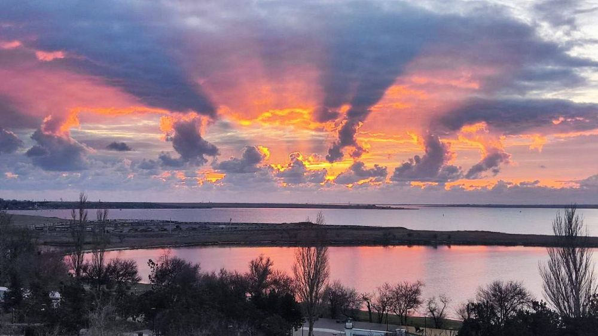

# Oбо мне: 

учусь в Нетологии

## пробую 5 разных варианта вставки картинки

 

### этот вариант я вставила на Гитхабе

#### этот оказался самый простой, с остальными пока загвоздка 

@solarrust благодарю Вас за курс "Git - cистема контроля версий"! Очень здорово и понятно! Вы молодец! 